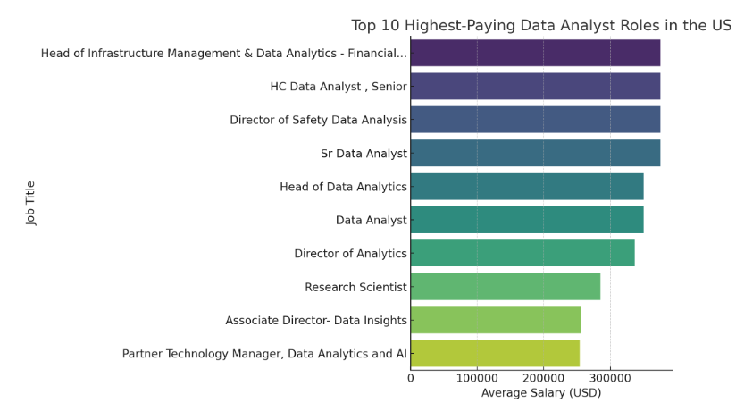
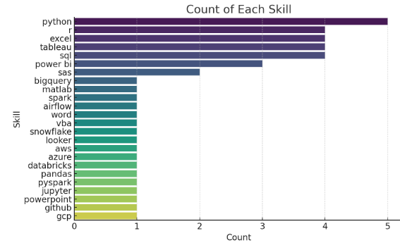
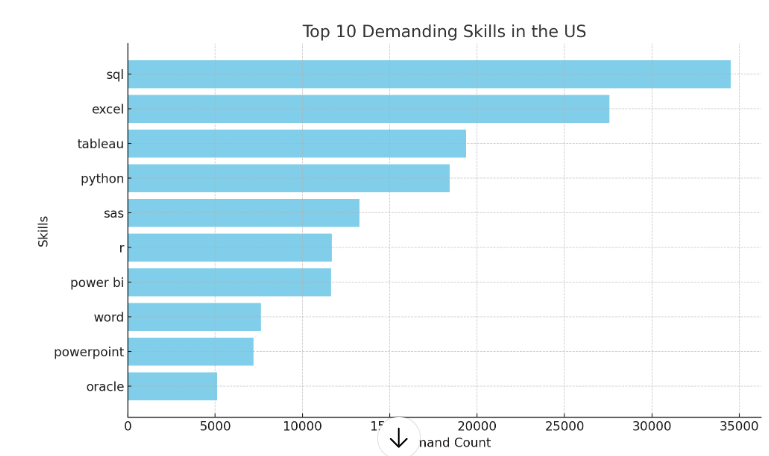
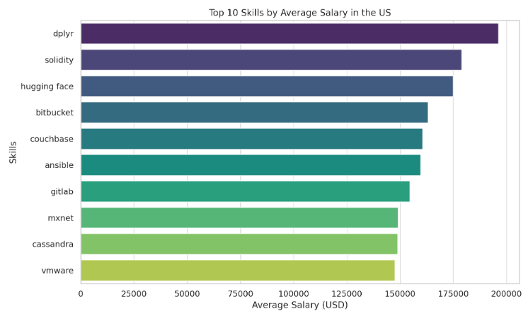
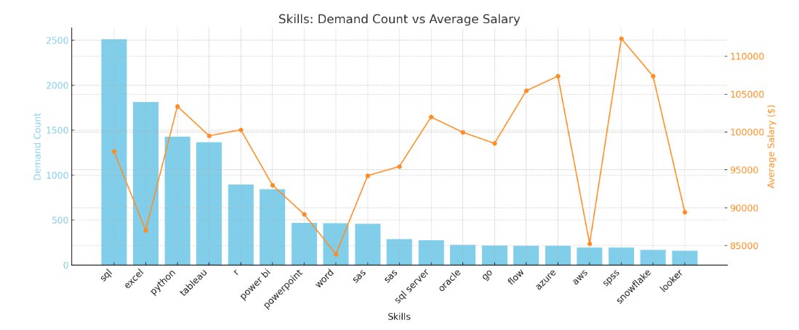

# Overview
### Welcome to My Project of SQL!! We are focusing on the skills about how to become a Data Analyst using SQL. This project started by creating a DataBase in Visual Studio Code by connecting the tool of pgAdmin4  
### The datasets are from Luke Barousse's SQL Course which provides a data tables for my analysis with detailed information to use SQL for data analyzing. 
[(Luke Barousse SQL Course Source)](https://github.com/lukebarousse/SQL_Project_Data_Job_Analysis)

## Questions:  
1. What are the Top-Paying Data Analyst Jobs in the United States?
2. What skills are required for the Top-Paying Data Analyst jobs in the US?
3. What are the most in-demand skills for Data Analyst in US?
4. What are the top skills based on Salary for Data Analyst in US?
5. What are the most optimal skills to learn in US as a Data Analyst?

## Main Tools:
- SQL(Structured Query Language): for interacting and communicating with relational databases
- PostgreSQL: The database management system, ideal for handling the job posting data
-  pgAdmin 4: It's a graphical user interface (GUI) tool for managing PostgreSQL databases
- Visual Studio Code: A powerful, lightweight, and highly customizable code editor that works great for a wide range of tasks
- Github - A platform that hosts Git repositories to store, share, and back up online

# Project Analysis
## Question 1: What are the Top-Paying Data Analyst Jobs in the United States?
View my codes with detailed steps here:  
[1_Top_Paying_Jobs.sql](Project_SQL\1_Top_Paying_Jobs.sql)
### Steps:
- Finding various Data Analyst roles that are in the US
- Focusing on job postings with specified salaries (Remove Null values)  

## Insights  
- The top 10 data analyst roles come from 9 different companies — Illuminate Mission Solutions appears twice.

- Highest paying roles hit a salary ceiling of $375,000 per year.

- Salaries range from $254,000 to $375,000, with a mean of $333,133.

## Question 2: What skills are required for the Top-Paying Data Analyst jobs in the US?  
View my codes with detailed steps here:  
[2_Top_Paying_Job_Skills.sql](Project_SQL\2_Top_Paying_Job_Skills.sql)
### Steps:  
- Using the first query(1_Top_Paying_Jobs) for the Top 10 highest paying Data Analyst jobs in US, for obtaining these jobs' required skills
- Creating a CTE for a temporary table of the top 10 highest paid company, adding the skill name on top of this table
  

## Question 3: What are the most in-demand skills for Data Analyst in US?
View my codes with detailed steps here:  
[3_Top_Demand_Skills.sql](Project_SQL\3_Top_Demand_Skills.sql)
### Steps:
- Identify the Top 10 in-demand skills for a Data Analyst in the US
- Therefore, we focus on the "Count" for skills of each job postings
### Data Analyst Top 10 skills in the US:

## Insights
- SQL is the most in-demand skill with a demand count of 34,505, indicating that data querying and management are highly valued across industries.

- Excel follows as the second most demanded skill with 27,576 postings, which reflects its continued importance in business operations and data analysis.

- Tableau and Python come next, with demand counts of 19,350 and 18,411, showcasing the strong need for data visualization and programming expertise.

- Other skills like SAS, Power BI, and R highlight the continued reliance on specialized data tools for analytics.

- Skills like PowerPoint and Word also feature in the top 10, suggesting that strong presentation and documentation skills remain relevant.
### Conclusion
Overall, the top skills strongly focus on data analytics, reporting, and tools that enable businesses to make data-driven decisions.

## Question 4: What are the top skills based on Salary for Data Analyst in US?
View my codes with detailed steps here:  
[4_Top_Paying_Skills.sql](Project_SQL\4_Top_Paying_Skills.sql)
### Steps:
- Identify each skill's salary year average for Data Analyst in US
- Searching the Top 10 skills with the highest salary year average
- Focus on specified salary(Remove Null)
- Round the values without decimals
  

## Insights
The top 10 skills based on average salary in the US, as per the data, are specialized or niche skills that command a premium due to either:

- High demand and low supply — Skills like Dplyr, Solidity, Hugging Face, and MxNet cater to specialized domains (data wrangling in R, blockchain smart contracts, AI/ML, and deep learning), where experienced professionals are relatively fewer.

- Enterprise infrastructure tools — Technologies like Couchbase, Cassandra, Ansible, and VMware also tend to be highly paid because they often support mission-critical backend systems at scale.

### (Interesting Observation) Why common skills like SQL, Python, Excel, and Power BI don’t appear?

- Widespread adoption: Skills like SQL, Python, Excel, and Power BI are very common and have a large talent pool. Because they’re broadly used across many industries and by professionals at all levels of experience, the average salary is lower relative to rarer skills.

- Entry and intermediate roles: Many positions requiring these skills don’t necessarily need deep expertise — they’re often considered baseline tools for data or business roles.

- Market saturation: The supply of professionals with these skills is much higher, which reduces salary premiums.
### Conclusion
If you’re looking to increase earning potential, picking up specialized tools like those shown in the chart — or advanced topics like AI, deep learning, blockchain, or specialized infrastructure — can offer a competitive edge and higher salary in the US.

## Question 5: What are the most optimal skills to learn in US as a Data Analyst?
View my codes with detailed steps here:  
[5_Optimal_Skills.sql](Project_SQL\5_Optimal_Skills.sql)

## Steps:
- Identify each skill with its Count and Salary year average(high-demand & high-paying)
- Focusing on specified Salary (Remove Null)
- Obtain the Top 20 skills with the highest dmeand and highest salary

## Top 20 skills for Data Analyst in the US on        (Demand Count vs Average Salary)

## Insights
- High-demand skills like SQL and Excel appear on the far right of the scatter plot — they have the largest demand (demand_count) — but their average salaries tend to be on the lower side of the scale (~$87k to $97k).

- Python and R are also in demand and show higher average salaries (~$100k+) compared to SQL and Excel.

- Tableau lies somewhere in the middle — fairly high demand (~1,366 postings) with an average salary close to $99,500.

- Some skills (not shown individually here due crowding) may show up as outliers with higher pay but lower demand — these would appear in the top left of the scatter (e.g. specialized programming languages or tools).
### Key Observation
Comparing with the skills from Question 4, you will notice that the skills that might not have large demand in US as Data Analyst, tend to have higher salary. 

## Conclusion & Recommendation:
If you’re choosing what to upskill in:

- Stick to Python and R if you want a mix of demand and salary.

- Consider specialized data tools if you want to aim for higher salaries but potentially fewer job postings.

- SQL and Excel will give you more openings, but they may need to be complemented with other technical skills to boost earning potential.